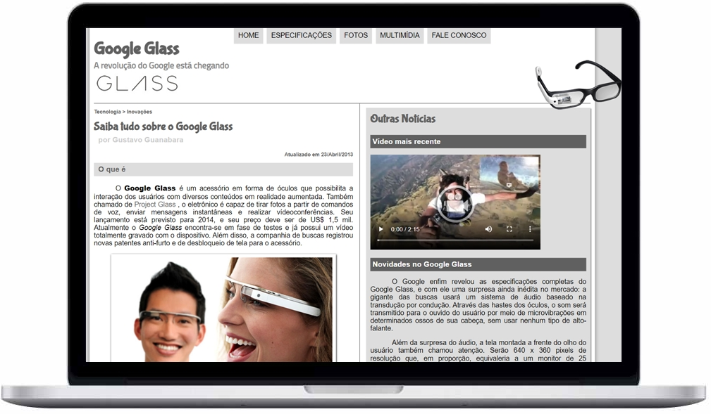

___

  

 

 

<a href="#dart-sobre">Sobre</a>&nbsp;&nbsp;&nbsp;|&nbsp;&nbsp;&nbsp;
<a href="#battery-tecnologias">Tecnologias</a>&nbsp;&nbsp;&nbsp;|&nbsp;&nbsp;&nbsp;
<a href="#electric_plug-execute">Execute</a>&nbsp;&nbsp;&nbsp;|&nbsp;&nbsp;&nbsp;
<a href="#fuelpump-autor">Autor</a>&nbsp;&nbsp;&nbsp;|&nbsp;&nbsp;&nbsp;
<a href="#memo-licença">Licença</a>

 

  

## :dart: Sobre

O site do **Google Glass** foi desenvolvido para a divulgação de sua tecnologia e inovação que seria trazida pela Google e que estava causando uma avalanche de notícias nos principais blogs de tecnologia na época de seu lançamento.

## :battery: Tecnologias

Esse projeto foi desenvolvido com as seguintes tecnologias:

- <a href="https://developer.mozilla.org/pt-BR/docs/Web/HTML">HTML</a>
- <a href="https://developer.mozilla.org/pt-BR/docs/Web/CSS">CSS</a>
- <a href="https://developer.mozilla.org/pt-BR/docs/Web/JavaScript">JAVASCRIPT</a>

## :electric_plug: Execute

- Abra o arquivo **index.html** *arrastando-o para dentro do seu navegador*, ou *utilizando o botão direito do mouse e clicando em* **abrir com...**.

## :fuelpump: Autor

- Projeto desenvolvido em 2018 através da descoberta do canal **Curso em Vídeo** no <a href="https://www.youtube.com/watch?v=epDCjksKMok&list=PLHz_AreHm4dlAnJ_jJtV29RFxnPHDuk9o">*Youtube*</a>;

- Acesse  <a href="https://github.com/cursoemvideo/cursoemvideo-html5">aqui</a> o **repositório oficial** do site.

## :memo: Licença

Esse projeto está sob a **Licença MIT**. Veja o arquivo [LICENSE](LICENSE.md) para mais detalhes.

---

<h5 align="center">  ✍🏻&nbsp; &nbsp;na &nbsp;👋🏻&nbsp;  por <a href="https://github.com/alissonpratesperes"> Alisson Prates Peres </a> &nbsp;👨🏻‍💻 </h5>
