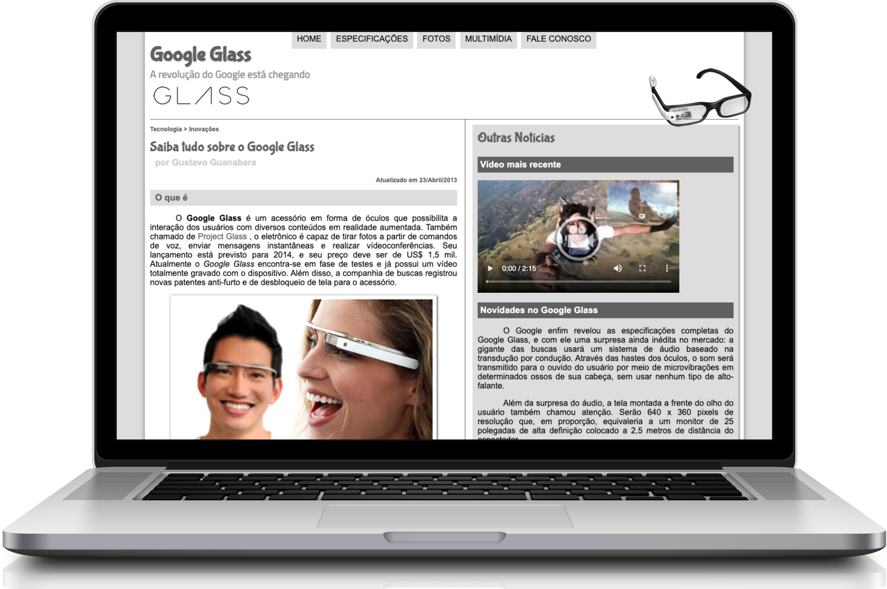



  

___

 

  <a href="#sobre">SOBRE</a>&nbsp;&nbsp;&nbsp;|&nbsp;&nbsp;&nbsp;<a href="#tecnologia">TECNOLOGIA</a>&nbsp;&nbsp;&nbsp;|&nbsp;&nbsp;&nbsp;<a href="#execute">EXECUTE</a>&nbsp;&nbsp;&nbsp;|&nbsp;&nbsp;&nbsp;<a href="#autor">AUTOR</a>&nbsp;&nbsp;&nbsp;|&nbsp;&nbsp;&nbsp;<a href="#licença">LICENÇA</a>

 

  

## SOBRE

O **site do Google Glass** foi desenvolvido para a divulgação de sua tecnologia e inovação que seria trazida pela Google e que estava causando uma avalanche de notícias nos principais blogs de tecnologia na época de seu lançamento.

## TECNOLOGIA

FRONT-END
- [HyperText Markup Language 5](https://developer.mozilla.org/pt-BR/docs/Web/HTML)
- [Cascading Style Sheets 3](https://developer.mozilla.org/pt-BR/docs/Web/CSS)
- [JavaScript](https://developer.mozilla.org/pt-BR/docs/Web/JavaScript)

## EXECUTE

    - Clonar este repositório
      |- Acessar o diretório: "./googleglass/frontend"
        >_ Executar o arquivo: "index.html"

## AUTOR

Projeto desenvolvido através do [Curso de HTML5 Completo e GRÁTIS](https://www.youtube.com/playlist?list=PLHz_AreHm4dlAnJ_jJtV29RFxnPHDuk9o) do [Gustavo Guanabara](https://www.youtube.com/c/CursoemVídeo) ocorrido em **Setembro de 2018**

Acesse [aqui](https://github.com/cursoemvideo/cursoemvideo-html5) o **repositório oficial** da aplicação

## LICENÇA

Esse projeto está sob a **Licença MIT** veja o arquivo [LICENSE](https://github.com/alissonpratesperes/googleglass/blob/main/LICENSE.md) para mais detalhes

___

👨🏻‍💻&nbsp;with&nbsp;❤️
