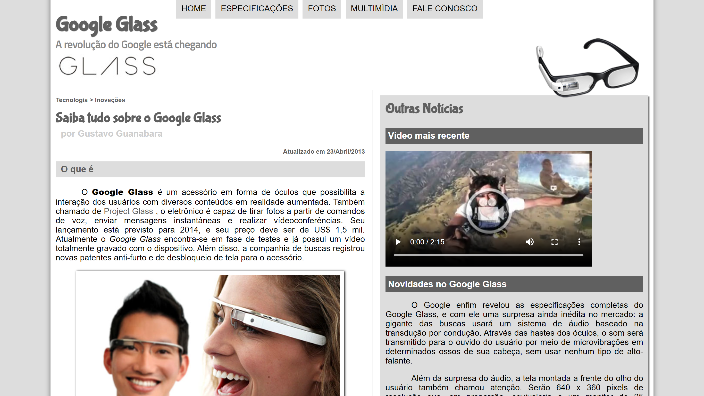



  

___

 

  🎯<a href="#dart-sobre">Sobre</a>&nbsp;&nbsp;&nbsp;|&nbsp;&nbsp;&nbsp;
  🔋<a href="#battery-tecnologias">Tecnologias</a>&nbsp;&nbsp;&nbsp;|&nbsp;&nbsp;&nbsp;
  🔌<a href="#electric_plug-execute">Execute</a>&nbsp;&nbsp;&nbsp;|&nbsp;&nbsp;&nbsp;
  ⛽<a href="#fuelpump-autor">Autor</a>&nbsp;&nbsp;&nbsp;|&nbsp;&nbsp;&nbsp;
  📝<a href="#memo-licença">Licença</a>

 

  

## :dart: Sobre

O **site do Google Glass** foi desenvolvido para a divulgação de sua tecnologia e inovação que seria trazida pela Google e que estava causando uma avalanche de notícias nos principais blogs de tecnologia na época de seu lançamento.

## :battery: Tecnologias

  Front-End:

<a href="https://developer.mozilla.org/pt-BR/docs/Web/HTML">HTML 5</a> 
<a href="https://developer.mozilla.org/pt-BR/docs/Web/CSS">CSS 3</a> 
<a href="https://developer.mozilla.org/pt-BR/docs/Web/JavaScript">JavaScript</a>

## :electric_plug: Execute

    - Clonar o Repositório;
      |- Acessar o diretório: "./googleglass";
        >_ Executar o arquivo: "index.html".

## :fuelpump: Autor

Projeto desenvolvido através do <a href="https://www.youtube.com/playlist?list=PLHz_AreHm4dlAnJ_jJtV29RFxnPHDuk9o">Curso de HTML5 Completo e GRÁTIS</a> do <a href="https://www.youtube.com/@CursoemVideo">Gustavo Guanabara</a>, em **2018**;

Acesse <a href="https://github.com/cursoemvideo/cursoemvideo-html5">aqui</a> o **repositório oficial** do Projeto.

## :memo: Licença

Esse projeto está sob a **Licença MIT**. Veja o arquivo [LICENSE](https://github.com/alissonpratesperes/googleglass/blob/main/LICENSE.md) para mais detalhes.

___

 👨🏻‍💻&nbsp;with&nbsp;🤍&nbsp;by&nbsp;<a href="https://github.com/alissonpratesperes">Alisson Prates Peres</a>&nbsp;✌🏻🥹
